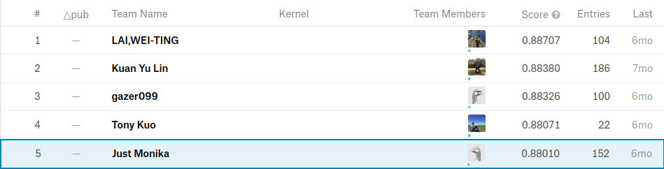

Ncu Data Science - Kaggle Competition
==
## Description
* URL : https://www.kaggle.com/c/ncu-course-game

## Python Env
* Jupyter in Anaconda
* python 3.7

## Dependencies
* numpy
* pandas
* sklearn
* lightgbm

## Result
* Rank : 5
* Score(Accuracy) : 0.88010

